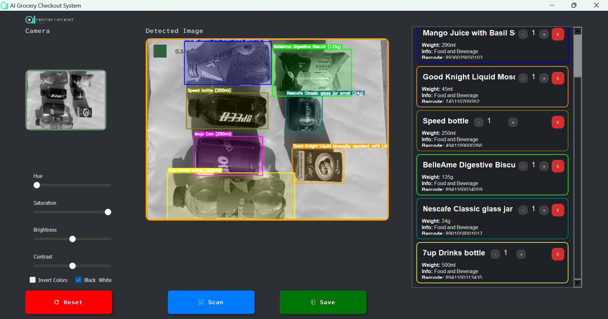

# AI Based Checkout System

<p align="center">
  
</p>

<h1 align="center">AI Based Checkout System</h1>

<p align="center">
    A desktop application that uses computer vision to identify products and automatically add them to a virtual shopping cart.
</p>

<p align="center">
    
    
</p>

---

## 🌟 Features

- **Real-time object detection:** Identifies products from a live camera feed.
- **Automatic cart updates:** Adds detected products to a virtual shopping cart.
- **Product details:** Displays information about each product, including name, weight, and price.
- **Interactive UI:** Allows users to manually add or remove items from the cart.
- **Save and export:** Saves the final shopping list to a text file.

---

## 🛠️ Technologies Used

<table>
  <tr>
    <td align="center">
      <a href="https://www.python.org/">
        
        <br>
        <sub><b>Python</b></sub>
      </a>
    </td>
    <td align="center">
      <a href="https://pytorch.org/">
        
        <br>
        <sub><b>PyTorch</b></sub>
      </a>
    </td>
    <td align="center">
      <a href="https://github.com/ultralytics/yolov5">
        
        <br>
        <sub><b>YOLOv8</b></sub>
      </a>
    </td>
    <td align="center">
      <a href="https://opencv.org/">
        
        <br>
        <sub><b>OpenCV</b></sub>
      </a>
    </td>
    <td align="center">
      <a href="https.cv.org/">
        
        <br>
        <sub><b>NumPy</b></sub>
      </a>
    </td>
    <td align="center">
      <a href="https://www.qt.io/qt-for-python">
        
        <br>
        <sub><b>PyQt5</b></sub>
      </a>
    </td>
  </tr>
</table>

---

## 📁 File Structure

```
AI-Based-Checkout-System/
├── app/
│   ├── app_code/
│   │   ├── custom_button.py
│   │   ├── grocery checkout gui normal.py
│   │   ├── grocery_checkout_gui.py
│   │   ├── GUI.py
│   │   └── product_card.py
│   ├── assets/
│   │   ├── All Food and Beverages_1.jpeg
│   │   ├── app_icon.png
│   │   ├── AtkinsonHyperlegibleMono-Regular.ttf
│   │   ├── beep.wav
│   │   ├── company_logo.png
│   │   ├── gui.png
│   │   ├── input_icon.png
│   │   ├── reset_icon.png
│   │   ├── scan_complete.wav
│   │   └── scan_icon.png
│   └── models/
│       └── yolov8m_14march_withgreyscale_best.pt
├── training_and_dataset_code/
│   ├── annotation_check.py
│   ├── basic_inference_yolo.py
│   ├── biy12.py
│   ├── class_balance_chech.py
│   ├── Convert OBB to Regular YOLO Format.py
│   ├── convert_obb_toAAB_coco.py
│   ├── convert_rgb_to_grey.py
│   ├── convert_yolo_to_fasterRcnn.py
│   ├── data.yaml
│   ├── spilt_into_trainVal.py
│   ├── yolo_averagetime_calculation.py
│   └── yolov8_trainig.py
├── .gitignore
├── detected_products.txt
├── PRODUCT_DETAILS.csv
├── README.md
└── requirements.txt
```

---

## 🚀 Getting Started

### Prerequisites

- Python 3.9 or later
- Pip (Python package installer)

### Installation

1. **Clone the repository:**

   ```bash
   git clone https://github.com/your-username/ai-based-checkout-system.git
   cd ai-based-checkout-system
   ```

2. **Create and activate a virtual environment:**

   ```bash
   python -m venv venv
   source venv/bin/activate  # On Windows, use `venv\Scripts\activate`
   ```

3. **Install the required dependencies:**

   ```bash
   pip install -r requirements.txt
   ```

### Running the Application

1. **Run the main application:**

   ```bash
   python app/app_code/GUI.py
   ```

2. **The application window will open, and the camera feed will be displayed.**

3. **Place products in front of the camera to have them automatically detected and added to the cart.**

4. **Click the "Save" button to save the final shopping list to `detected_products.txt`.**

---

## 🤝 Contributing

Contributions are welcome! Please feel free to submit a pull request or open an issue if you have any suggestions or find any bugs.

---

## 📄 License

This project is licensed under the MIT License - see the [LICENSE](LICENSE) file for details.